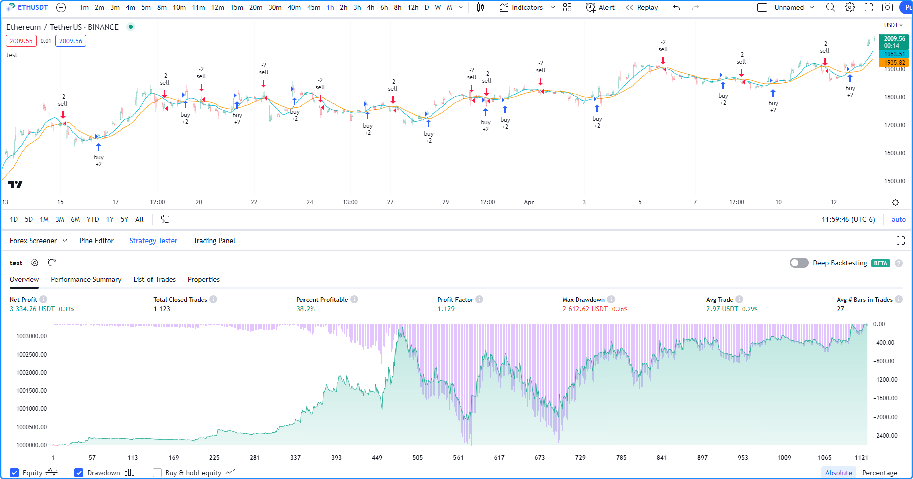

.. image:: /images/Pine_Script_logo.svg
   :alt: Pine Script™ logo
   :target: https://www.tradingview.com/pine-script-docs/en/v5/Introduction.html
   :align: right
   :width: 100
   :height: 100

.. _PageStrategies:

Strategies
==========

.. contents:: :local:
    :depth: 3

Introduction
------------

Pine Script™ strategies simulate the execution of trades on historical and real-time 
data to facilitate the backtesting and forward testing of trading systems. They include 
many of the same capabilities as Pine Script™ indicators while providing the ability to 
place, modify, and cancel hypothetical orders and analyze the results.

When a script uses the 
`strategy() <https://www.tradingview.com/pine-script-reference/v5/#fun_strategy>`__ 
function for its declaration, it gains access to the ``strategy.*`` namespace, where 
it can call functions and variables for simulating orders and accessing essential 
strategy information. Additionally, the script will display information and simulated 
results externally in the "Strategy Tester" tab.

.. _PageStrategies_ASimpleStrategyExample:

A simple strategy example
-------------------------

The following script is a simple strategy that simulates the entry of long or short 
positions upon the crossing of two moving averages:

::

    //@version=5
    strategy("test", overlay = true)
    
    // Calculate two moving averages with different lengths.
    float fastMA = ta.sma(close, 14)
    float slowMA = ta.sma(close, 28)
    
    // Enter a long position when `fastMA` crosses over `slowMA`.
    if ta.crossover(fastMA, slowMA)
        strategy.entry("buy", strategy.long)
    
    // Enter a short position when `fastMA` crosses under `slowMA`.
    if ta.crossunder(fastMA, slowMA)
        strategy.entry("sell", strategy.short)
    
    // Plot the moving averages.
    plot(fastMA, "Fast MA", color.aqua)
    plot(slowMA, "Slow MA", color.orange)

Note that:
 - The ``strategy("test" overlay = true)`` line declares that the script is a strategy 
   named "test" with visual outputs overlaid on the main chart pane.
 - `strategy.entry() <https://www.tradingview.com/pine-script-reference/v5/#fun_strategy{dot}entry>`__ 
   is the command that the script uses to simulate "buy" and "sell" orders. When the script places an 
   order, it also plots the order ``id`` on the chart and an arrow to indicate the direction.
 - Two `plot() <https://www.tradingview.com/pine-script-reference/v5/#fun_plot>`__ functions 
   plot the moving averages with two different colors for visual reference.

.. _PageStrategies_ApplyingAStrategyToAChart:

Applying a strategy to a chart
------------------------------

To test a strategy, apply it to the chart. You can use a built-in strategy from the 
"Indicators & Strategies" dialog box or write your own in the Pine Editor. Click 
"Add to chart" from the "Pine Editor" tab to apply a script to the chart:

After a strategy script is compiled and applied to a chart, it will plot order marks 
on the main chart pane and display simulated performance results in the 
"Strategy Tester" tab below:

.. note:: 
   The results from a strategy applied to non-standard charts 
   (`Heikin Ashi <https://www.tradingview.com/?solution=43000619436>`__, 
   `Renko <https://www.tradingview.com/?solution=43000502284>`__, 
   `Line Break <https://www.tradingview.com/?solution=43000502273>`__, 
   `Kagi <https://www.tradingview.com/?solution=43000502272>`__, 
   `Point & Figure <https://www.tradingview.com/?solution=43000502276>`__, 
   and `Range <https://www.tradingview.com/?solution=43000474007>`__) 
   do not reflect actual market conditions. Strategy scripts will use the synthetic 
   price values from these charts during simulation, which often do not reflect actual 
   market prices and will thus produce unrealistic backtest results. We therefore 
   highly recommend using only standard chart types for backtesting strategies.

.. _PageStrategies_StrategyTester:

Strategy tester
---------------

The Strategy Tester module is available to all scripts declared with the 
`strategy() <https://www.tradingview.com/pine-script-reference/v5/#fun_strategy>`__ 
function. Users can access this module from the "Strategy Tester" tab below their 
charts, where they can conveniently visualize their strategies and analyze 
hypothetical performance results. 

.. _PageStrategies_StrategyTester_Overview:

Overview
^^^^^^^^

The `Overview <https://www.tradingview.com/?solution=43000681733>`__ tab of the 
Strategy Tester presents essential performance metrics and equity and drawdown 
curves over a simulated sequence of trades, providing a quick look at strategy 
performance without diving into granular detail. The chart in this section shows 
the strategy's `equity curve <https://www.tradingview.com/?solution=43000681735>`__ 
as a baseline plot centered at the initial value, the 
`buy and hold equity curve <https://www.tradingview.com/?solution=43000681736>`__ as a 
line plot, and the `drawdown curve <https://www.tradingview.com/?solution=43000681734>`__ 
as a histogram plot. Users can toggle these plots and scale them as absolute values or 
percentages using the options below the chart.

Note that:
 - The overview chart uses two scales; the left is for the equity curves, and the right 
   is for the drawdown curve.
 - When a user clicks a point on these plots, this will direct the main chart view to 
   the point where the trade was closed.

.. _PageStrategies_StrategyTester_PerformanceSummary:

Performance summary
^^^^^^^^^^^^^^^^^^^

The `Performance Summary <https://www.tradingview.com/?solution=43000681683>`__ tab 
of the module presents a comprehensive overview of a strategy's performance metrics. 
It displays three columns: one for all trades, one for all longs, and one for all shorts, 
to provide traders with more detailed insights on a strategy's long, short, and overall 
simulated trading performance.

.. _PageStrategies_StrategyTester_ListOfTrades:

List of trades
^^^^^^^^^^^^^^

The `List of Trades <https://www.tradingview.com/?solution=43000681737>`__ tab provides 
a granular look at the trades simulated by a strategy with essential information, 
including the date and time of execution, the type of order used (entry or exit), the number 
of contracts/shares/lots/units traded, and the price, as well as some key trade performance metrics.

Note that:
 - Users can navigate the times of specific trades on their charts by clicking on them in this list.

.. _PageStrategies_StrategyTester_Properties:

Properties
^^^^^^^^^^

The Properties tab provides detailed information about a strategy's configuration and the 
dataset to which it is applied. It includes the strategy's date range, symbol information, 
script settings, and strategy properties.

* **Date Range** - Includes the range of dates with simulated trades and the total available backtesting range.
* **Symbol Info** - Contains the symbol name and broker/exchange, the chart's timeframe and type, the tick size, the point value for the chart, and the base currency.
* **Strategy Inputs** - Outlines the various parameters and variables used in the strategy script available in the "Inputs" tab of the script settings.
* **Strategy Properties** - Provides an overview of the configuration of the trading strategy. It includes essential details such as the initial capital, base currency, order size, margin, pyramiding, commission, and slippage. Additionally, this section highlights any modifications made to strategy calculation behavior.

.. _PageStrategies_BrokerEmulator:

Broker emulator
---------------

TradingView utilizes a *broker emulator* to simulate the performance of trading strategies. 
Unlike in real-life trading, the emulator strictly uses available chart prices for order 
simulation. Consequently, the simulation can only place historical trades after a bar closes, 
and it can only place real-time trades on a new price tick. For more information on this 
behavior, please refer to the :ref:`Pine Script™ Execution model <PageExecutionModel>`.

Since the emulator can only use chart data, it makes assumptions about intrabar price movement. 
It uses a bar's open, high, and low prices to infer intrabar activity while calculating order 
fills with the following logic:

* If the high price is closer to the opening price than the low price, it assumes that the 
   price moved in this order on the bar: open → high → low → close.
* If the low price is closer to the opening price than the high price, it assumes that the 
   price moved in this order on the bar: open → low → high → close.
* The broker emulator assumes no gaps exist between prices within bars; in the "eyes" of the 
   emulator, the full range of intrabar prices is available for order execution.

.. image:: images/Strategies-Broker-emulator-1.png

.. _PageBrokerEmulator_BarMagnifier:

Bar magnifier
^^^^^^^^^^^^^

Premium account holders can override the broker emulator's intrabar assumptions via the 
``use_bar_magnifier`` parameter of the 
`strategy() <https://www.tradingview.com/pine-script-reference/v5/#fun_strategy>`__ 
function or the "Use bar magnifier" input in the "Properties" tab of the script settings. 
The `Bar Magnifier <https://www.tradingview.com/?solution=43000669285>`__ inspects data 
on timeframes smaller than the chart's to obtain more granular information about price 
action within a bar, thus allowing more precise order fills during simulation.

To demonstrate, the following script places a "Buy" limit order at the ``entryPrice`` 
and an "Exit" limit order at the ``exitPrice`` when the 
`time <https://www.tradingview.com/pine-script-reference/v5/#var_time>`__ value 
crosses the ``orderTime``, and draws two horizontal lines to visualize the order prices. 
The script also highlights the background using the ``orderColor`` to indicate when 
the strategy placed the orders:

::

    //@version=5
    strategy("Bar Magnifier Demo", overlay = true, use_bar_magnifier = false)

    //@variable The UNIX timestamp to place the order at.
    int orderTime = timestamp("UTC", 2023, 3, 22, 18)

    //@variable Returns `color.orange` when `time` crosses the `orderTime`, false otherwise.
    color orderColor = na

    // Entry and exit prices.
    float entryPrice = hl2 - (high - low)
    float exitPrice  = entryPrice + (high - low) * 0.25

    // Entry and exit lines.
    var line entryLine = na
    var line exitLine  = na

    if ta.cross(time, orderTime)
        // Draw new entry and exit lines.
        entryLine := line.new(bar_index, entryPrice, bar_index + 1, entryPrice, color = color.green, width = 2)
        exitLine  := line.new(bar_index, exitPrice, bar_index + 1, exitPrice, color = color.red, width = 2)
        
        // Update order highlight color.
        orderColor := color.new(color.orange, 80)
        
        // Place limit orders at the `entryPrice` and `exitPrice`.
        strategy.entry("Buy", strategy.long, limit = entryPrice)
        strategy.exit("Exit", "Buy", limit = exitPrice)

    // Update lines while the position is open.
    else if strategy.position_size > 0.0
        entryLine.set_x2(bar_index + 1)
        exitLine.set_x2(bar_index + 1)

    bgcolor(orderColor)

As we see in the chart above, the broker emulator assumed that intrabar prices moved 
from open to high, then high to low, then low to close on the bar the "Buy" order filled 
on, meaning the emulator assumed that the "Exit" order couldn't fill on the same bar. 
However, after including ``use_bar_magnifier = true`` in the declaration statement, 
we see a different story:

Note:
   The maximum amount of intrabars that a script can request is 100,000. 
   Some symbols with lengthier history may not have full intrabar coverage 
   for their beginning chart bars with this limitation, meaning that simulated 
   trades on those bars will not be affected by the bar magnifier. 

.. _PageStrategies_OrdersAndEntries:

Orders and entries
------------------

Just like in real-life trading, Pine strategies use orders to manage positions. In this 
context, an *order* is a command to simulate a market action, and a *trade* is the result 
after the order fills. Thus, to enter or exit positions using Pine, users must create 
orders with parameters that specify how they'll behave. 

To take a closer look at how orders work and how they become trades, let's write a simple 
strategy script:

::

    //@version=5
    strategy("My strategy", overlay=true, margin_long=100, margin_short=100)

    //@function Displays text passed to `txt` when called.
    debugLabel(txt) => label.new(bar_index, high, text = txt, style = label.style_label_lower_right)

    longCondition = bar_index % 20 == 0 // true on every 20th bar
    if (longCondition)
        debugLabel("Long entry order created")
        strategy.entry("My Long Entry Id", strategy.long)
    strategy.close_all()

In this script, we've defined a ``longCondition`` that is true whenever the ``bar_index`` is 
divisible by 20, i.e., every 20th bar. The strategy uses this condition within an 
`if <https://www.tradingview.com/pine-script-reference/v5/#op_if>`__ structure to simulate an entry order with 
`strategy.entry() <https://www.tradingview.com/pine-script-reference/v5/#fun_strategy{dot}entry>`__
and draw a label at the entry price with the user-defined ``debugLabel()`` function. The script calls 
`strategy.close_all() <https://www.tradingview.com/pine-script-reference/v5/#fun_strategy{dot}close_all>`__
from the global scope to simulate a market order that closes any open position. 
Let's see what happens once we add the script to our chart:

The blue arrows on the chart indicate entry locations, and the purple ones mark the points where 
the strategy closed positions. Notice that the labels precede the actual entry point rather than 
occurring on the same bar - this is orders in action. By default, Pine strategies wait for the 
next available price tick before filling orders, as filling an order on the same tick isn't realistic. 
Also, they recalculate on the close of every historical bar, meaning the next available tick to 
fill an order at is the open of the next bar in this case. As a result, by default, all orders are 
delayed by one chart bar.

It's important to note that although the script calls 
`strategy.close_all() <https://www.tradingview.com/pine-script-reference/v5/#fun_strategy{dot}close_all>`__ 
from the global scope, forcing execution on every bar, the function call does nothing if the strategy 
isn't simulating an open position. If there is an open position, the command issues a market order to 
close it, which executes on the next available tick. For example, when the ``longCondition`` is true 
on bar 20, the strategy places an entry order to fill at the next tick, which is at the open of bar 21. 
Once the script recalculates its values on that bar's close, the function places an order to close the 
position, which fills at the open of bar 22. 

.. _PageStrategies_OrdersAndEntries_OrderPlacementCommands:

Order placement commands
^^^^^^^^^^^^^^^^^^^^^^^^

Pine Script™ strategies use the following functions from the ``strategy.*`` namespace to 
simulate the placement of orders:

`strategy.entry() <https://www.tradingview.com/pine-script-reference/v5/#fun_strategy{dot}entry>`__
   This command simulates entry orders. It is affected by the pyramiding setting in the strategy's properties and by the 
   `strategy.risk.allow_entry_in() <https://www.tradingview.com/pine-script-reference/v5/#fun_strategy{dot}risk{dot}allow_entry_in>`__ 
   function. If there are open positions and a script places entry orders in the opposite 
   direction, it will add the current number of contracts/shares/lots/units to the quantity. 
   As a result, the size of the opened market position will equal the ``qty`` specified in 
   the function call.

`strategy.exit() <https://www.tradingview.com/pine-script-reference/v5/#fun_strategy{dot}exit>`__ 
   This command simulates exit orders. It allows a strategy to exit a market position or form 
   multiple exit orders using a stop loss, profit target, or trailing stop. All exit orders belong 
   to the same `strategy.oca.reduce` 
   group. Strategies cannot simulate exit orders when there is no open market position or active 
   entry order, as exit orders are bound to the ``id`` of a corresponding entry order. It is 
   possible to exit from the same entry order more than once using the same exit order ID, which 
   facilitates the formation of multi-level exit strategies. When performing multiple exit commands, 
   each order's quantity must be a portion of the open trade quantity, with their sum not exceeding 
   the open position. If the ``qty`` of the function is less than the size of the current market 
   position, the strategy will simulate a partial exit. In cases where a market position is composed 
   of multiple entry orders (with ``pyramiding`` enabled), each exit order must link to a matching 
   entry order. If the ``qty`` value of an exit command exceeds the open position's quantity, the 
   strategy will do nothing since it cannot fill more contracts/shares/lots/units than that amount.

`strategy.order() <https://www.tradingview.com/pine-script-reference/v5/#fun_strategy{dot}order>`__
   This command simulates entry and exit orders. It is not affected by pyramiding settings or the 
   `strategy.risk.allow_entry_in() <https://www.tradingview.com/pine-script-reference/v5/#fun_strategy{dot}risk{dot}allow_entry_in>`__ 
   function. It allows users to create complex entry and exit order constructions when the functionality of 
   `strategy.entry() <https://www.tradingview.com/pine-script-reference/v5/#fun_strategy{dot}entry>`__
   and `strategy.exit() <https://www.tradingview.com/pine-script-reference/v5/#fun_strategy{dot}exit>`__ 
   will not suffice. If there is an open market position when the script generates an order in the 
   opposite direction, it will ignore the number of contracts/shares/lots/units held. As a result, 
   the size of the opened market position will equal the net sum of the open position and the order size.

`strategy.close() <https://www.tradingview.com/pine-script-reference/v5/#fun_strategy{dot}close>`__
   This command simulates exit positions using a market order. The function closes a trade upon the 
   occurrence of a condition rather than a specific price. Unlike other order functions, it uses 
   its ``id`` parameter to reference an existing entry ID and does not belong to any `OCA` group. 
   If the user does not specify the order ID to close, the strategy will not execute the order. 

`strategy.close_all() <https://www.tradingview.com/pine-script-reference/v5/#fun_strategy{dot}close_all>`__
   This command allows a strategy to simulate the exit of all open positions with a single market order, 
   irrespective of the number or their IDs.

`strategy.cancel() <https://www.tradingview.com/pine-script-reference/v5/#fun_strategy{dot}cancel>`__
   This command cancels orders issued by 
   `strategy.exit() <https://www.tradingview.com/pine-script-reference/v5/#fun_strategy{dot}exit>`__  
   and `strategy.order() <https://www.tradingview.com/pine-script-reference/v5/#fun_strategy{dot}order>`__
   or `strategy.entry() <https://www.tradingview.com/pine-script-reference/v5/#fun_strategy{dot}entry>`__ 
   when they use a ``limit`` or ``stop`` argument. This function cannot cancel market orders such as 
   `strategy.close() <https://www.tradingview.com/pine-script-reference/v5/#fun_strategy{dot}close>`__
   or `strategy.order() <https://www.tradingview.com/pine-script-reference/v5/#fun_strategy{dot}order>`__
   and `strategy.entry() <https://www.tradingview.com/pine-script-reference/v5/#fun_strategy{dot}entry>`__ 
   without ``limit`` or ``stop`` arguments.

`strategy.cancel_all() <https://www.tradingview.com/pine-script-reference/v5/#fun_strategy{dot}cancel_all>`__
   This command cancels all pending limit and stop orders without regard to the number of orders or their IDs.

.. _PageStrategies_OrdersAndEntries_OrderTypes:

Order types
^^^^^^^^^^^

PineScript strategies allow users to simulate different order types for their particular needs. 
The main notable types are *market*, *limit*, *stop*, and *stop-limit*.

Market orders
~~~~~~~~~~~~~

Market orders are the most basic type of orders. They command a strategy to buy or sell a security 
as soon as possible, regardless of the price. Consequently, they always execute on the next available 
price tick. By default, all ``strategy.*()`` functions that generate orders specifically produce market orders.

The following script simulates a long market order when the ``bar_index`` is divisible by ``2 * cycleLength``. 
Otherwise, it simulates a short market order when the ``bar_index`` is divisible by ``cycleLength``, 
resulting in a strategy with alternating long and short trades once every ``cycleLength`` bars:

::

    //@version=5
    strategy("Market order demo", overlay=true, margin_long=100, margin_short=100)

    //@variable Number of bars between long and short entries.
    cycleLength = input.int(10, "Cycle length")

    //@function Displays text passed to `txt` when called.
    debugLabel(txt) => label.new(bar_index, high, text = txt, style = label.style_label_lower_right)

    // Generate a long market order when `bar_index` is divisible by twice the `cycleLength`.
    if bar_index % (2 * cycleLength) == 0
        debugLabel("Long market order created")
        strategy.entry("My Long Entry Id", strategy.long)
    // Otherwise, generate a short market order when `bar_index` is divisible by the `cycleLength`. 
    else if bar_index % cycleLength == 0
        debugLabel("Short market order created")
        strategy.entry("My Short Entry Id", strategy.short)

Limit orders
~~~~~~~~~~~~

Limit orders command a strategy to enter a position at a specific price or better (lower than specified for long 
positions and higher for short ones). When the current market price is better than the order command's ``limit`` 
parameter, the order will fill without waiting for the market price to reach the limit.

To simulate limit orders in a script, pass a price value to an order placement command with a ``limit`` parameter. 
The following example places a limit order 500 ticks below the bar close 100 bars before the ``last_bar_index``:

::

    //@version=5
    strategy("Limit order demo", overlay=true, margin_long=100, margin_short=100)

    //@function Displays text passed to `txt` when called.
    debugLabel(price, txt) =>
        label.new(bar_index, price, text = txt, style = label.style_label_lower_right)
        line.new(bar_index, price, bar_index + 1, price, extend = extend.right, style = line.style_dashed)

    // Generate a long limit order 100 bars before the `last_bar_index`.
    if last_bar_index - bar_index == 100
        limitPrice = close - syminfo.mintick * 500
        debugLabel(limitPrice, "Long Limit order created")
        strategy.entry("Long", strategy.long, limit = limitPrice)

Note how the script placed the label and started the line several bars before the trade. As long as the price remained 
above the ``limitPrice`` value, the order could not fill. Once the market price reached the limit, the strategy executed 
the trade mid-bar.

Stop and stop-limit orders
~~~~~~~~~~~~~~~~~~~~~~~~~~

Stop orders command a strategy to simulate another order only once the market price crosses the specified ``stop`` price. 
Unlike limit orders, stop orders wait for the price to cross the specified level, regardless of whether the current price is 
better. Once the price crosses the value, the strategy will place a new order of either the market or limit type. If the order 
placement command includes a ``limit`` argument, the subsequent order will be a limit order at the specified value. Otherwise, 
it will be a market order.

The script below places a stop order 800 ticks above the ``close`` 100 bars ago. In this example, the strategy entered 
a long position when the market price crossed the ``stop`` price several bars after it placed the order. Notice that the 
initial price at the time of the order was better than the one passed to ``stop``. An equivalent limit order would have filled 
on the following chart bar:

::

    //@version=5
    strategy("Stop order demo", overlay=true, margin_long=100, margin_short=100)

    //@function Displays text passed to `txt` when called and shows the `price` level on the chart.
    debugLabel(price, txt) =>
        label.new(bar_index, high, text = txt, style = label.style_label_lower_right)
        line.new(bar_index, high, bar_index, price, style = line.style_dotted)
        line.new(bar_index, price, bar_index + 1, price, extend = extend.right, style = line.style_dashed)

    // Generate a long market order when 100 bars before the last bar
    if last_bar_index - bar_index == 100
        stopPrice = close + syminfo.mintick * 800
        debugLabel(stopPrice, "Long Stop order created")
        strategy.entry("Long", strategy.long, stop = stopPrice)

Order placement commands that use both ``limit`` and ``stop`` arguments produce stop-limit orders. This order type 
waits for the price to cross the stop level, then places a limit order at the specified ``limit`` price.

Let's modify our previous script to simulate a stop-limit order. In this example, we've included a ``limit`` value 
of 200 ticks below the ``close`` 100 bars ago. Notice how the market price initially reaches the limit level, but the 
strategy doesn't simulate a trade because the price must cross the stop level to place the pending limit order:

::

    //@version=5
    strategy("Stop-limit order demo", overlay=true, margin_long=100, margin_short=100)

    //@function Displays text passed to `txt` when called and shows the `price` level on the chart.
    debugLabel(price, txt = "") =>
        label.new(bar_index, high, text = txt, style = label.style_label_lower_right)
        line.new(bar_index, high, bar_index, price, style = line.style_dotted)
        line.new(bar_index, price, bar_index + 1, price, extend = extend.right, style = line.style_dashed)

    // Generate a long market order when 100 bars before the last bar
    if last_bar_index - bar_index == 100
        stopPrice = close + syminfo.mintick * 800
        limitPrice = close - syminfo.mintick * 200
        debugLabel(stopPrice)
        debugLabel(limitPrice, "Long Stop-Limit order created")
        strategy.entry("Long", strategy.long, stop = stopPrice, limit = limitPrice)

.. _PageStrategies_PositionSizing:

Position sizing
---------------

Pine Script™ strategies feature two ways to control the sizes of simulated trades:

* Set a default fixed quantity type and value for all orders using the ``default_qty_type`` and ``default_qty_value`` arguments in the `strategy() <https://www.tradingview.com/pine-script-reference/v5/#fun_strategy>`__ function, which also sets the default values in the "Properties" tab of the script settings.
* Specify the ``qty`` argument when calling `strategy.entry() <https://www.tradingview.com/pine-script-reference/v5/#fun_strategy{dot}entry>`__. When a user supplies this argument to the function, the script ignores the strategy's default quantity value and type. 

The following example simulates "Buy" orders of ``longAmount`` size whenever the ``low`` 
price equals the ``lowest`` value, and "Sell" orders of ``shortAmount`` size when the 
``high`` price equals the ``highest`` value:

::

    //@version=5
    strategy("Buy low, sell high", overlay = true, default_qty_type = strategy.cash, default_qty_value = 5000)

    int   length      = input.int(20, "Length")
    float longAmount  = input.float(4.0, "Long Amount")
    float shortAmount = input.float(2.0, "Short Amount")

    float highest = ta.highest(length)
    float lowest  = ta.lowest(length)

    switch
        low == lowest   => strategy.entry("Buy", strategy.long, longAmount)
        high == highest => strategy.entry("Sell", strategy.short, shortAmount)

Notice that in the above example, although we've specified the ``default_qty_type`` 
and ``default_qty_value`` arguments in the declaration statement, the script does 
not use these defaults for the simulated orders. Instead, it sizes them as a 
``longAmount`` and ``shortAmount`` of contracts/shares/lots/units. If we want the 
script to use the default type and value, we must remove the ``qty`` specification 
from the `strategy.entry() <https://www.tradingview.com/pine-script-reference/v5/#fun_strategy{dot}entry>`__ 
calls:

::

    //@version=5
    strategy("Buy low, sell high", overlay = true, default_qty_type = strategy.cash, default_qty_value = 5000)

    int length = input.int(20, "Length")

    float highest = ta.highest(length)
    float lowest  = ta.lowest(length)

    switch
        low == lowest   => strategy.entry("Buy", strategy.long)
        high == highest => strategy.entry("Sell", strategy.short)

.. _PageStrategies_ClosingAMarketPosition:

Closing a market position
-------------------------

Although it is possible to simulate an exit from a specific entry order shown in the 
:ref:`List of Trades <PageStrategies_ListOfTrades>` tab of the 
:ref:`Strategy Tester <PageStrategies_StrategyTester>` module, all orders are linked 
according to FIFO (first in, first out) rules. If the user does not specify the ``from_entry`` parameter of a 
`strategy.exit() <https://www.tradingview.com/pine-script-reference/v5/#fun_strategy{dot}exit>`__  
call, the strategy will exit the open market position starting from the first entry order that opened it. 

The following example simulates two orders sequentially: "Buy1" at the market price 
for the last 100 bars and "Buy2" once the position size matches the size of "Buy1". 
The strategy only places an exit order when the ``positionSize`` is 15 units. 
The script does not supply a ``from_entry`` argument to the 
`strategy.exit() <https://www.tradingview.com/pine-script-reference/v5/#fun_strategy{dot}exit>`__ 
command, so the strategy places exit orders for all open positions each time it calls the function, 
starting with the first. It plots the ``positionSize`` in a separate pane for visual reference:

::

    //@version=5
    strategy("Exit Demo", pyramiding = 2)

    float positionSize = strategy.position_size

    if positionSize == 0 and last_bar_index - bar_index <= 100
        strategy.entry("Buy1", strategy.long, 5)
    else if positionSize == 5
        strategy.entry("Buy2", strategy.long, 10)
    else if positionSize == 15
        strategy.exit("bracket", loss = 10, profit = 10)

    plot(positionSize == 0 ? na : positionSize, "Position Size", color.lime, 4, plot.style_histogram)

Note that:
 - We included ``pyramiding = 2`` in our script's declaration statement to allow it to simulate two consecutive orders in the same direction.

Suppose we wanted to exit "Buy2" before "Buy1". Let's see what happens if we instruct 
the strategy to close "Buy2" before "Buy1" when it fills both orders:

::

    //@version=5
    strategy("Exit Demo", pyramiding = 2)

    float positionSize = strategy.position_size

    if positionSize == 0 and last_bar_index - bar_index <= 100
        strategy.entry("Buy1", strategy.long, 5)
    else if positionSize == 5
        strategy.entry("Buy2", strategy.long, 10)
    else if positionSize == 15
        strategy.close("Buy2")
        strategy.exit("bracket", "Buy1", loss = 10, profit = 10)

    plot(positionSize == 0 ? na : positionSize, "Position Size", color.lime, 4, plot.style_histogram)

As we can see in the Strategy Tester's "List of Trades" tab, rather than closing the "Buy2" 
position with `strategy.close() <https://www.tradingview.com/pine-script-reference/v5/#fun_strategy{dot}close>`__, 
it closes the quantity of "Buy1" first, which is half the quantity of the close order, then 
closes half of the "Buy2" position, as the broker emulator follows FIFO rules by default. 
Users can change this behavior by specifying ``close_entries_rule = "ANY"`` in the 
`strategy() <https://www.tradingview.com/pine-script-reference/v5/#fun_strategy>`__ function.

.. _PageStrategies_OCAGroups:

OCA groups
----------

One-Cancels-All (OCA) groups allow a strategy to fully or partially cancel other orders upon the 
execution of order placement commands, including 
`strategy.entry() <https://www.tradingview.com/pine-script-reference/v5/#fun_strategy{dot}entry>`__ 
and `strategy.order() <https://www.tradingview.com/pine-script-reference/v5/#fun_strategy{dot}order>`__, 
with the same ``oca_name``, depending on the ``oca_type`` that the user provides in the function call.

`strategy.oca.cancel <https://www.tradingview.com/pine-script-reference/v5/#var_strategy{dot}oca{dot}cancel>`__
   This OCA type cancels all orders with the same ``oca_name`` upon the fill or partial fill of an order from the group.

For example, the following strategy executes orders upon ``ma1`` crossing ``ma2``. When the 
`strategy.position_size <https://www.tradingview.com/pine-script-reference/v5/#var_strategy{dot}position_size>`__ 
is 0, it places a long-stop and short-stop order on the high and low of the bar. Otherwise, it calls 
`strategy.close_all() <https://www.tradingview.com/pine-script-reference/v5/#fun_strategy{dot}close_all>`__ 
to close all open positions with a market order. Depending on the broker emulator's intrabar assumption for the 
chart bar, the strategy may fill both stop orders on the same bar. The 
`strategy.close_all() <https://www.tradingview.com/pine-script-reference/v5/#fun_strategy{dot}close_all>`__ command 
does nothing in this case, as the script cannot invoke the action until after already executing both orders:

.. image:: images/Strategies-OCA-groups-Strategy-oca-cancel-1.png

::

    //@version=5
    strategy("OCA Cancel Demo", overlay=true)
    
    float ma1 = ta.sma(close, 5)
    float ma2 = ta.sma(close, 9)
    
    if ta.cross(ma1, ma2)
        if strategy.position_size == 0
            strategy.order("Long",  strategy.long, stop = high)
            strategy.order("Short", strategy.short, stop = low)
        else
            strategy.close_all()
    
    plot(ma1, "Fast MA", color.aqua)
    plot(ma2, "Slow MA", color.orange)

To eliminate scenarios where the strategy fills long and short orders on the same bar, 
we can instruct it to cancel one order after it executes the other. In this example, 
we've set the ``oca_name`` for both 
`strategy.order() <https://www.tradingview.com/pine-script-reference/v5/#fun_strategy{dot}order>`__ 
commands to "Entry" and their ``oca_type`` to ``strategy.oca.cancel``:

.. image:: images/Strategies-OCA-groups-Strategy-oca-cancel-2.png

::

    //@version=5
    strategy("OCA Cancel Demo", overlay=true)
    
    float ma1 = ta.sma(close, 5)
    float ma2 = ta.sma(close, 9)
    
    if ta.cross(ma1, ma2)
        if strategy.position_size == 0
            strategy.order("Long",  strategy.long, stop = high, oca_name = "Entry", oca_type = strategy.oca.cancel)
            strategy.order("Short", strategy.short, stop = low, oca_name = "Entry", oca_type = strategy.oca.cancel)
        else
            strategy.close_all()
    
    plot(ma1, "Fast MA", color.aqua)
    plot(ma2, "Slow MA", color.orange)

`strategy.oca.reduce <https://www.tradingview.com/pine-script-reference/v5/#var_strategy{dot}oca{dot}reduce>`__
   This OCA type does not cancel orders. Instead, it reduces the size of orders with the same ``oca_name`` upon each 
   new fill by the number of closed contracts/shares/lots/units, which is particularly useful for exit strategies.

The following example demonstrates an attempt at a long-only exit strategy that generates a stop-loss order and 
two take-profit orders for each new entry. Upon the crossover of two moving averages, it simulates a "Long" entry 
order using `strategy.entry() <https://www.tradingview.com/pine-script-reference/v5/#fun_strategy{dot}entry>`__ 
with a ``qty`` of 6 units, then simulates stop/limit orders for 6, 3, and 3 units using 
`strategy.order() <https://www.tradingview.com/pine-script-reference/v5/#fun_strategy{dot}order>`__  
at the ``stop``, ``limit1``, and ``limit2`` prices respectively. 

After adding the strategy to our chart, we see it doesn't work as intended. The issue with this script is that 
`strategy.order() <https://www.tradingview.com/pine-script-reference/v5/#fun_strategy{dot}order>`__ 
doesn't belong to an OCA group by default, unlike 
`strategy.exit() <https://www.tradingview.com/pine-script-reference/v5/#fun_strategy{dot}exit>`__. 
Since we have not explicitly assigned the orders to an OCA group, the strategy does not cancel or reduce 
them when it fills one, meaning it's possible to trade a greater quantity than the open position and reverse the direction:

.. image:: images/Strategies-OCA-groups-Strategy-oca-reduce-1.png

::

    //@version=5
    strategy("Multiple TP Demo", overlay = true)
    
    var float stop   = na
    var float limit1 = na
    var float limit2 = na
    
    bool longCondition = ta.crossover(ta.sma(close, 5), ta.sma(close, 9))
    if longCondition and strategy.position_size == 0
        stop   := close * 0.99
        limit1 := close * 1.01
        limit2 := close * 1.02
        strategy.entry("Long",  strategy.long, 6)
        strategy.order("Stop",  strategy.short, stop = stop, qty = 6)
        strategy.order("Limit 1", strategy.short, limit = limit1, qty = 3)
        strategy.order("Limit 2", strategy.short, limit = limit2, qty = 3)
    
    bool showPlot = strategy.position_size != 0
    plot(showPlot ? stop   : na, "Stop",    color.red,   style = plot.style_linebr)
    plot(showPlot ? limit1 : na, "Limit 1", color.green, style = plot.style_linebr)
    plot(showPlot ? limit2 : na, "Limit 2", color.green, style = plot.style_linebr)

For our strategy to work as intended, we must instruct it to reduce the number of units for the other 
stop-loss/take-profit orders so that they do not exceed the size of the remaining open position. 

In the example below, we've set the ``oca_name`` for each order in our exit strategy to "Bracket" and the 
``oca_type`` to 
`strategy.oca.reduce <https://www.tradingview.com/pine-script-reference/v5/#var_strategy{dot}oca{dot}reduce>`__. 
These settings tell the strategy to reduce the ``qty`` values of orders in the "Bracket" group by the ``qty`` 
filled when it executes one of them, preventing it from trading an excessive number of units and causing a reversal:

::

    //@version=5
    strategy("Multiple TP Demo", overlay = true)
    
    var float stop   = na
    var float limit1 = na
    var float limit2 = na
    
    bool longCondition = ta.crossover(ta.sma(close, 5), ta.sma(close, 9))
    if longCondition and strategy.position_size == 0
        stop   := close * 0.99
        limit1 := close * 1.01
        limit2 := close * 1.02
        strategy.entry("Long",  strategy.long, 6)
        strategy.order("Stop",  strategy.short, stop = stop, qty = 6, oca_name = "Bracket", oca_type = strategy.oca.reduce)
        strategy.order("Limit 1", strategy.short, limit = limit1, qty = 3, oca_name = "Bracket", oca_type = strategy.oca.reduce)
        strategy.order("Limit 2", strategy.short, limit = limit2, qty = 6, oca_name = "Bracket", oca_type = strategy.oca.reduce)
    
    bool showPlot = strategy.position_size != 0
    plot(showPlot ? stop   : na, "Stop",    color.red,   style = plot.style_linebr)
    plot(showPlot ? limit1 : na, "Limit 1", color.green, style = plot.style_linebr)
    plot(showPlot ? limit2 : na, "Limit 2", color.green, style = plot.style_linebr)

Note that:
 - We changed the ``qty`` of the "Limit 2" order to 6 instead of 3 because the strategy will reduce its value by 3 when it fills the "Limit 1" order. Keeping the ``qty`` value of 3 would cause it to drop to 0 and never fill after filling the first limit order.

`strategy.oca.none <https://www.tradingview.com/pine-script-reference/v5/#var_strategy{dot}oca{dot}none>`__
This OCA type specifies that an order executes independently of an OCA group. This value is the default ``oca_type`` 
for `strategy.order() <https://www.tradingview.com/pine-script-reference/v5/#fun_strategy{dot}order>`__ 
and `strategy.entry() <https://www.tradingview.com/pine-script-reference/v5/#fun_strategy{dot}entry>`__ 
order placement commands.

.. note::
   If two order placement commands have the same ``oca_name`` but different ``oca_type`` values, 
   the strategy considers them to be from two distinct groups. i.e., OCA groups cannot combine 
   `strategy.oca.cancel <https://www.tradingview.com/pine-script-reference/v5/#var_strategy{dot}oca{dot}cancel>`__, 
   `strategy.oca.reduce <https://www.tradingview.com/pine-script-reference/v5/#var_strategy{dot}oca{dot}reduce>`__, 
   and `strategy.oca.none <https://www.tradingview.com/pine-script-reference/v5/#var_strategy{dot}oca{dot}none>`__ 
   OCA types.

.. _PageStrategies_Currency:

Currency
--------

Pine Script™ strategies can use different base currencies than the instruments they calculate on. 
Users can specify the simulated account's base currency by including a ``currency.*`` variable as 
the ``currency`` argument in the 
`strategy() <https://www.tradingview.com/pine-script-reference/v5/#fun_strategy>`__ 
function, which will change the script's 
`strategy.account_currency <https://www.tradingview.com/pine-script-reference/v5/#var_strategy{dot}account_currency>`__ 
value. The default ``currency`` value for strategies is ``currency.NONE``, meaning that the script 
uses the base currency of the instrument on the chart.

When a strategy script uses a specified base currency, it multiplies the simulated profits by the 
FX_IDC conversion rate from the previous trading day. For example, the strategy below places an entry 
order for a standard lot (100,000 units) with a profit target and stop-loss of 1 point on each of the 
last 500 chart bars, then plots the net profit alongside the inverted daily close of the symbol in a 
separate pane. We have set the base currency to ``currency.EUR``. When we add this script to FX_IDC:EURUSD, 
the two plots align, confirming the strategy uses the previous day's rate from this symbol for its calculations:

::

    //@version=5
    strategy("Currency Test", currency = currency.EUR)

    if last_bar_index - bar_index < 500
        strategy.entry("LE", strategy.long, 100000)
        strategy.exit("LX", "LE", profit = 1, loss = 1)
    plot(math.abs(ta.change(strategy.netprofit)), "1 Point profit", color = color.fuchsia, linewidth = 4)
    plot(request.security(syminfo.tickerid, "D", 1 / close)[1], "Previous day's inverted price", color = color.lime)

Note that:
 - When trading on timeframes higher than daily, the strategy will use the closing price from one trading day 
   before the bar closes for cross-rate calculation on historical bars. For example, on a weekly timeframe, 
   it will base the cross-rate on the previous Thursday's closing value, though the strategy will still use 
   the daily closing rate for real-time bars. 

.. _PageStrategies_AlteringCalculationBehavior:

Altering calculation behavior
-----------------------------

Strategies execute on all historical bars available from a chart, then automatically continue their 
calculations in real-time as new data is available. By default, strategy scripts only calculate once 
per confirmed bar. We can alter this behavior by changing the parameters of the 
`strategy() <https://www.tradingview.com/pine-script-reference/v5/#fun_strategy>`__ 
function or clicking the checkboxes in the "Recalculate" section of the script's "Properties" tab.

.. _PageStrategies_AlteringCalculationBehavior_CalcOnEveryTick:

\`calc_on_every_tick\`
^^^^^^^^^^^^^^^^^^^^^^

``calc_on_every_tick`` is an optional setting that controls the calculation behavior on 
real-time data. When this parameter is enabled, the script will recalculate its values on 
each new price tick. By default, its value is false, meaning the script only executes 
calculations after a bar is confirmed.

Enabling this calculation behavior may be particularly useful when forward testing since it 
facilitates granular, real-time strategy simulation. However, it's important to note that this 
behavior introduces a data difference between real-time and historical simulations, as historical 
bars do not contain tick information. Users should exercise caution with this setting, as the data 
difference may cause a strategy to repaint its history.

The following script will simulate a new order each time that ``close`` reaches the ``highest`` or 
``lowest`` value over the input ``length``. Since ``calc_on_every_tick`` is enabled in the strategy 
declaration, the script will simulate new orders on each new real-time price tick after compilation:

::

    //@version=5
    strategy("Donchian Channel Break", overlay = true, calc_on_every_tick = true, pyramiding = 20)

    int length = input.int(15, "Length")

    float highest = ta.highest(close, length)
    float lowest  = ta.lowest(close, length)

    if close == highest
        strategy.entry("Buy", strategy.long)
    if close == lowest
        strategy.entry("Sell", strategy.short)

    //@variable The starting time for real-time bars.
    var realTimeStart = timenow

    // Color the background of real-time bars.
    bgcolor(time_close >= realTimeStart ? color.new(color.orange, 80) : na)

    plot(highest, "Highest", color = color.lime)
    plot(lowest, "Lowest", color = color.red)

Note that:
 - The script uses a ``pyramiding`` value of 20 in its declaration, which allows the 
   strategy to simulate a maximum of 20 trades in the same direction.
 - To visually demarcate what bars are processed as real-time bars by the strategy, 
   the script colors the background for all bars since the 
   `timenow <https://www.tradingview.com/pine-script-reference/v5/#var_timenow>`__ 
   that it was last compiled.

After applying the script to the chart and letting it calculate on some real-time bars, 
we may see an output like the following:

.. image:: images/Strategies-Altering-calculation-behavior-Calc-on-every-tick-1.png

The script placed "Buy" orders on each new real-time tick the condition was valid on, resulting in 
multiple orders per bar. However, it may surprise users unfamiliar with this behavior to see the 
strategy's outputs change after recompiling the script, as the bars that it previously executed real-time 
calculations on are now historical bars, which do not hold tick information:

.. _PageStrategies_AlteringCalculationBehavior_CalcOnOrderFills:

\`calc_on_order_fills\`
^^^^^^^^^^^^^^^^^^^^^^^

The optional ``calc_on_order_fills`` setting enables the recalculation of a strategy immediately after 
simulating an order fill, which allows the script to use more granular prices and place additional orders 
without waiting for a bar to be confirmed.

Enabling this setting can provide the script with additional data that would otherwise not be available 
until after a bar closes, such as the current average price of a simulated position on an unconfirmed bar.

The example below shows a simple strategy declared with ``calc_on_order_fills`` enabled that simulates a "Buy" order when the 
`strategy.position_size <https://www.tradingview.com/pine-script-reference/v5/#var_strategy{dot}position_size>`__ is 0. 
The script uses the 
`strategy.position_avg_price <https://www.tradingview.com/pine-script-reference/v5/#var_strategy{dot}position_avg_price>`__ 
to calculate a ``stopLoss`` and ``takeProfit`` and simulates "Exit" orders when the price crosses them, regardless of whether 
the bar is confirmed. As a result, as soon as an exit is triggered, the strategy recalculates and places a new entry order because 
the `strategy.position_size <https://www.tradingview.com/pine-script-reference/v5/#var_strategy{dot}position_size>`__ 
is once again equal to 0. The strategy places the order once the exit happens and executes it on the next tick after the exit, 
which will be one of the bar's OHLC values, depending on the emulated intrabar movement:

.. image:: images/Strategies-Altering-calculation-behavior-Calc-on-order-fills-1.png

::

    //@version=5
    strategy("Intrabar exit", overlay = true, calc_on_order_fills = true)

    float stopSize   = input.float(5.0, "SL %", minval = 0.0) / 100.0
    float profitSize = input.float(5.0, "TP %", minval = 0.0) / 100.0

    if strategy.position_size == 0.0
        strategy.entry("Buy", strategy.long)

    float stopLoss   = strategy.position_avg_price * (1.0 - stopSize)
    float takeProfit = strategy.position_avg_price * (1.0 + profitSize)

    strategy.exit("Exit", stop = stopLoss, limit = takeProfit)

Note that:
 - With ``calc_on_order_fills`` turned off, the same strategy will only ever enter one bar after it triggers an exit order. 
   First, the mid-bar exit will happen, but no entry order. Then, the strategy will simulate an entry order once the bar 
   closes, which it will fill on the next tick after that, i.e., the open of the next bar.

It's important to note that enabling ``calc_on_order_fills`` may produce unrealistic strategy results, 
as the broker emulator may assume order prices that are not possible when trading in real-time. 
Users must exercise caution with this setting and carefully consider the logic in their scripts.

The following example simulates a "Buy" order after each new order fill and bar confirmation over a 25-bar window from the 
`last_bar_index <https://www.tradingview.com/pine-script-reference/v5/#var_last_bar_index>`__ 
when the script loaded on the chart. With the setting enabled, the strategy simulates four entries per bar 
since the emulator considers each bar to have four ticks (open, high, low, close), which is unrealistic behavior, 
as it's not typically possible for an order to fill at the exact high or low of a bar:

::

    //@version=5
    strategy("buy on every fill", overlay = true, calc_on_order_fills = true, pyramiding = 100)

    if last_bar_index - bar_index <= 25
        strategy.entry("Buy", strategy.long)

.. _PageStrategies_AlteringCalculationBehavior_ProcessOrdersOnClose:

\`process_orders_on_close\`
^^^^^^^^^^^^^^^^^^^^^^^^^^^

The default strategy behavior simulates orders at the close of each bar, meaning that the earliest 
opportunity to fill the orders and execute strategy calculations and alerts is upon the opening of 
the following bar. Traders can change this behavior to process a strategy using the closing value 
of each bar by enabling the ``process_orders_on_close`` setting.

This behavior is most useful when backtesting manual strategies in which traders exit positions 
before a bar closes or in scenarios where algorithmic traders in non-24x7 markets set up after-hours 
trading capability so that alerts sent after close still have hope of filling before the following day.

Note that:
 - It's crucial to be aware that using strategies with ``process_orders_on_close`` in a live trading 
   environment may lead to a repainting strategy, as alerts on the close of a bar still occur when the 
   market closes, and orders may not fill until the next market open.

.. _PageStrategies_SimulatingTradingCosts:

Simulating trading costs
------------------------

For a strategy performance report to contain relevant, meaningful data, traders should strive to 
account for potential real-world costs in their strategy results. Neglecting to do so may give 
traders an unrealistic view of strategy performance and undermine the credibility of test results. 
Without modeling the potential costs associated with their trades, traders may overestimate a 
strategy's historical profitability, potentially leading to suboptimal decisions in live trading. 
Pine Script™ strategies include inputs and parameters for simulating trading costs in performance results. 

.. _PageStrategies_SimulatingTradingCosts_Commission:

Commission
^^^^^^^^^^

Commission refers to the fee a broker/exchange charges when executing trades. Depending on the broker/exchange, 
some may charge a flat fee per trade or contract/share/lot/unit, and others may charge a percentage of the total 
transaction value. Users can set the commission properties of their strategies by including ``commission_type`` 
and ``commission_value`` arguments in the `strategy() <https://www.tradingview.com/pine-script-reference/v5/#fun_strategy>`__ 
function or by setting the "Commission" inputs in the "Properties" tab of the strategy settings.

The following script is a simple strategy that simulates a "Long" position of 2% of equity when ``close`` equals 
the ``highest`` value over the ``length``, and closes the trade when it equals the ``lowest`` value:

::

    //@version=5
    strategy("Commission Demo", overlay=true, default_qty_value = 2, default_qty_type = strategy.percent_of_equity)

    length = input.int(10, "Length")

    float highest = ta.highest(close, length)
    float lowest  = ta.lowest(close, length)

    switch close
        highest => strategy.entry("Long", strategy.long)
        lowest  => strategy.close("Long")

    plot(highest, color = color.new(color.lime, 50))
    plot(lowest, color = color.new(color.red, 50))

Upon inspecting the results in the Strategy Tester, we see that the strategy had a positive equity growth of 
17.49% over the testing range. However, the backtest results do not account for fees the broker/exchange may 
charge. Let's see what happens to these results when we include a small commission on every trade in the 
strategy simulation. In this example, we've included ``commission_type = strategy.commission.percent`` 
and ``commission_value = 1`` in the `strategy() <https://www.tradingview.com/pine-script-reference/v5/#fun_strategy>`__ 
declaration, meaning it will simulate a commission of 1% on all executed orders:

::

    //@version=5
    strategy(
        "Commission Demo", overlay=true, default_qty_value = 2, default_qty_type = strategy.percent_of_equity,
        commission_type = strategy.commission.percent, commission_value = 1
    )

    length = input.int(10, "Length")

    float highest = ta.highest(close, length)
    float lowest  = ta.lowest(close, length)

    switch close
        highest => strategy.entry("Long", strategy.long)
        lowest  => strategy.close("Long")

    plot(highest, color = color.new(color.lime, 50))
    plot(lowest, color = color.new(color.red, 50))

As we can see in the example above, after applying a 1% commission to the backtest, the strategy simulated a 
significantly reduced net profit of only 1.36% and a more volatile equity curve with an elevated max drawdown, 
highlighting the impact commission simulation can have on a strategy's test results.

.. _PageStrategies_SimulatingTradingCosts_SlippageAndLimits:

Slippage and unfilled limits
^^^^^^^^^^^^^^^^^^^^^^^^^^^^

In real-life trading, a broker/exchange may fill orders at slightly different prices than a trader intended 
due to volatility, liquidity, order size, and other market factors, which can profoundly impact a strategy's 
performance. The disparity between expected prices and the actual prices at which the broker/exchange executes 
trades is what we refer to as slippage. Slippage is dynamic and unpredictable, making it impossible to simulate 
precisely. However, factoring in a small amount of slippage on each trade during a backtest or forward test may 
help the results better align with reality. Users can model slippage in their strategy results, sized as a fixed 
number of ticks, by including a ``slippage`` argument in the 
`strategy() <https://www.tradingview.com/pine-script-reference/v5/#fun_strategy>`__ 
declaration or by setting the "Slippage" input in the "Properties" tab of the strategy settings.

The following example demonstrates how slippage simulation affects the fill prices of market orders in a strategy 
test. The script below places a "Buy" market order of 2% equity when the market price is above an EMA while the EMA 
is rising and closes the position when the price dips below the EMA while it's falling. We've included 
``slippage = 20`` in the `strategy() <https://www.tradingview.com/pine-script-reference/v5/#fun_strategy>`__ 
function, which declares that the price of each simulated order will slip 20 ticks in the direction of the trade during simulation. The script uses 
`strategy.opentrades.entry_bar_index() <https://www.tradingview.com/pine-script-reference/v5/#fun_strategy{dot}opentrades{dot}entry_bar_index>`__ 
and `strategy.closedtrades.exit_bar_index() <https://www.tradingview.com/pine-script-reference/v5/#fun_strategy{dot}closedtrades{dot}exit_bar_index>`__ 
to get the ``entryIndex`` and ``exitIndex``, which it utilizes to obtain the ``fillPrice`` of the order. When the 
bar index is at the ``entryIndex``, the ``fillPrice`` is 
`strategy.position_avg_price <https://www.tradingview.com/pine-script-reference/v5/#var_strategy{dot}position_avg_price>`__. 
At the ``exitIndex``, ``fillPrice`` is the 
`strategy.closedtrades.exit_price() <https://www.tradingview.com/pine-script-reference/v5/#fun_strategy{dot}closedtrades{dot}exit_price>`__ 
value from the last closed trade. The script plots the expected fill price along with the 
simulated fill price after slippage to visually compare the difference:

::

    //@version=5
    strategy(
        "Slippage Demo", overlay = true, slippage = 20,
        default_qty_value = 2, default_qty_type = strategy.percent_of_equity
    )

    int length = input.int(5, "Length")

    float ma = ta.ema(close, length)

    if close > ma and ma > ma[1]
        strategy.entry("Buy", strategy.long)
    if close < ma and ma < ma[1]
        strategy.close("Buy")

    int entryIndex = strategy.opentrades.entry_bar_index(0)
    int exitIndex  = strategy.closedtrades.exit_bar_index(strategy.closedtrades - 1)

    float fillPrice = switch bar_index
        entryIndex => strategy.position_avg_price
        exitIndex  => strategy.closedtrades.exit_price(strategy.closedtrades - 1)

    plot(ma, color = color.new(color.orange, 50))

    plotchar(fillPrice ? open : na, "Expected fill price", "—", location.absolute, color.lime)
    plotchar(fillPrice, "Fill price after slippage", "—", location.absolute, color.fuchsia)

Some traders may assume that they can avoid the adverse effects of slippage by using limit orders, as unlike 
market orders, they cannot execute at a worse price than the specified value. However, depending on the state 
of the real-life market, even if the market price reaches an order price, there's a chance that a limit order 
may not fill, as limit orders can only fill if a security has sufficient liquidity and price action around the 
value. To account for the possibility of unfilled orders in a backtest, users can specify the 
``backtest_fill_limits_assumption`` value in the declaration statement or use the "Verify price for limit orders" 
input in the "Properties" tab to instruct the strategy to fill limit orders only after prices move a defined 
number of ticks past order prices.

The following example places a limit order of 2% equity at a bar's ``hlcc4`` when the ``high`` is the ``highest`` 
value over the past ``length`` bars and there are no pending entries. The strategy closes the market position and 
cancels all orders when the ``low`` is the ``lowest`` value. Each time the strategy triggers an order, it draws a 
horizontal line at the ``limitPrice``, which it updates on each bar until closing the position or cancelling the order:

::

    //@version=5
    strategy(
        "Verify price for limits example", overlay = true,
        default_qty_type = strategy.percent_of_equity, default_qty_value = 2
    )

    int length = input.int(25, title = "Length")

    //@variable Draws a line at the limit price of the most recent entry order.
    var line limitLine = na

    // Highest high and lowest low
    highest = ta.highest(length)
    lowest  = ta.lowest(length)

    // Place an entry order and draw a new line when the the `high` equals the `highest` value and `limitLine` is `na`.
    if high == highest and na(limitLine)
        float limitPrice = hlcc4
        strategy.entry("Long", strategy.long, limit = limitPrice)
        limitLine := line.new(bar_index, limitPrice, bar_index + 1, limitPrice)

    // Close the open market position, cancel orders, and set `limitLine` to `na` when the `low` equals the `lowest` value.
    if low == lowest
        strategy.cancel_all()
        limitLine := na
        strategy.close_all()

    // Update the `x2` value of `limitLine` if it isn't `na`.
    if not na(limitLine)
        limitLine.set_x2(bar_index + 1) 

    plot(highest, "Highest High", color = color.new(color.green, 50))
    plot(lowest, "Lowest Low", color = color.new(color.red, 50))

By default, the script assumes that all limit orders are guaranteed to fill. However, this is often not the case 
in real-life trading. Let's add price verification to our limit orders to account for potentially unfilled ones. 
Below, we have included ``backtest_fill_limits_assumption = 3`` in the 
`strategy() <https://www.tradingview.com/pine-script-reference/v5/#fun_strategy>`__ function call.
As we can see, using limit verification omits some simulated order fills and changes the times of others since the 
entry orders can now only fill after the price penetrates the limit price by three ticks:

.. note::
   It's important to notice that although the limit verification changed the times of some order fills, the strategy 
   simulated them at the same prices. This "time-warping" effect is a compromise that preserves the prices of verified 
   limit orders, but can cause the strategy to simulate their fills at times that wouldn't necessarily be possible in 
   the real world. Users should exercise caution with this setting and understand its limitations when analyzing strategy 
   results.

.. _PageStrategies_RiskManagement:

Risk management
---------------

Designing a strategy that performs well, let alone one that does so in a broad class 
of markets, is a challenging task. Most are designed for specific market patterns/conditions 
and may produce uncontrollable losses when applied to other data. Therefore, a strategy's 
risk management qualities can be critical to its performance. Users can set risk management 
criteria in their strategy scripts using the special commands with the ``strategy.risk`` prefix. 

Strategies can incorporate any number of risk management criteria in any combination. All risk 
management commands execute on every tick and order execution event, regardless of any changes 
to the strategy's calculation behavior. There is no way to disable any of these commands at a 
script's runtime. Irrespective of the risk rule's location, it will always apply to the strategy 
unless the user removes the call from the code.

`strategy.risk.allow_entry_in() <https://www.tradingview.com/pine-script-reference/v5/#fun_strategy{dot}risk{dot}allow_entry_in>`__
   This command overrides the market direction allowed for 
   `strategy.entry() <https://www.tradingview.com/pine-script-reference/v5/#fun_strategy{dot}entry>`__ 
   commands. When a user specifies the trade direction with this function (e.g., 
   `strategy.direction.long <https://www.tradingview.com/pine-script-reference/v5/#var_strategy{dot}direction{dot}long>`__), 
   the strategy will only enter trades in that direction. However, it's important to note that 
   if a script calls an entry command in the opposite direction while there's an open market 
   position, the strategy will simulate a market order to exit the position. 

`strategy.risk.max_cons_loss_days() <https://www.tradingview.com/pine-script-reference/v5/#fun_strategy{dot}risk{dot}max_cons_loss_days>`__
   This command cancels all pending orders, closes the open market position, and stops all 
   additional trade actions after the strategy simulates a defined number of trading days 
   with consecutive losses.

`strategy.risk.max_drawdown() <https://www.tradingview.com/pine-script-reference/v5/#fun_strategy{dot}risk{dot}max_drawdown>`__
   This command cancels all pending orders, closes the open market position, and stops all 
   additional trade actions after the strategy's drawdown reaches the amount specified in 
   the function call.

`strategy.risk.max_intraday_filled_orders() <https://www.tradingview.com/pine-script-reference/v5/#fun_strategy{dot}risk{dot}max_intraday_filled_orders>`__
   This command specifies the maximum number of filled orders per trading day (or per chart bar 
   if the timeframe is higher than daily). Once the strategy executes the maximum number of orders 
   for the day, it cancels all pending orders, closes the open market position, and halts trading 
   activity until the end of the current session.

`strategy.risk.max_intraday_loss() <https://www.tradingview.com/pine-script-reference/v5/#fun_strategy{dot}risk{dot}max_intraday_loss>`__
   This command controls the maximum loss the strategy will tolerate per trading day (or per chart 
   bar if the timeframe is higher than daily). When the strategy's losses reach this threshold, it 
   will cancel all pending orders, close the open market position, and stop all trading activity 
   until the end of the current session.

`strategy.risk.max_position_size() <https://www.tradingview.com/pine-script-reference/v5/#fun_strategy{dot}risk{dot}max_position_size>`__
   This command specifies the maximum possible position size when using 
   `strategy.entry() <https://www.tradingview.com/pine-script-reference/v5/#fun_strategy{dot}entry>`__ 
   commands. If the quantity of an entry command results in a market position that exceeds this 
   threshold, the strategy will reduce the order quantity so that the resulting position does 
   not exceed the limitation.

.. _PageStrategies_Margin:

Margin
--------

Margin is the minimum percentage of a market position a trader must hold in their account as 
collateral to receive and sustain a loan from their broker to achieve their desired leverage. 
The ``margin_long`` and ``margin_short`` parameters of the 
`strategy() <https://www.tradingview.com/pine-script-reference/v5/#fun_strategy>`__ 
declaration and the "Margin for long/short positions" inputs in the "Properties" tab of the 
script settings allow strategies to specify margin percentages for long and short positions. 
For example, if a trader sets the margin for long positions to 25%, they must have enough funds 
to cover 25% of an open long position. This margin percentage also means the trader can 
potentially spend up to 400% of their equity on their trades.

If a strategy's simulated funds cannot cover the losses from a margin trade, the broker emulator 
triggers a margin call, which forcibly liquidates all or part of the position. The exact number 
of contracts/shares/lots/units that the emulator liquidates is four times what is required to cover 
a loss to prevent constant margin calls on subsequent bars. The emulator calculates the amount 
using the following algorithm:

1. Calculate the amount of capital spent on the position: ``Money Spent = Quantity * Entry Price``
2. Calculate the Market Value of Security (MVS): ``MVS = Position Size * Current Price``
3. Calculate the Open Profit as the difference between ``MVS`` and ``Money Spent``. If the position is short, we multiply this by -1.
4. Calculate the strategy's equity value: ``Equity = Initial Capital + Net Profit + Open Profit``
5. Calculate the margin ratio: ``Margin Ratio = Margin Percent / 100``
6. Calculate the margin value, which is the cash required to cover the trader's portion of the position: ``Margin = MVS * Margin Ratio``
7. Calculate the available funds: ``Available Funds = Equity - Margin``
8. Calculate the total amount of money the trader has lost: ``Loss = Available Funds / Margin Ratio``
9. Calculate how many contracts/shares/lots/units the trader would need to liquidate to cover the loss. We truncate this value to the same decimal precision as the minimum position size for the current symbol: ``Cover Amount = TRUNCATE(Loss / Current Price).``
10. Calculate how many units the broker will liquidate to cover the loss: ``Margin Call = Cover Amount * 4``

To examine this calculation in detail, let's add the built-in Supertrend Strategy to the NASDAQ:TSLA chart on the 1D timeframe and set the 
"Order size" to 300% of equity and the "Margin for long positions" to 25% in the "Properties" tab of the strategy settings:

The first entry happened at the bar's opening price on 16 Sep 2010. The strategy bought 682,438 shares (Position size) 
at 4.43 USD (Entry price). Then, on 23 Sep 2010, when the price dipped to 3.9 (Current price), the emulator forcibly 
liquidated 111,052 shares via margin call.

.. code-block:: text
    Money spent: 682438 * 4.43 = 3023200.34
    MVS: 682438 * 3.9 = 2661508.2
    Open Profit: −361692.14
    Equity: 1000000 + 0 − 361692.14 = 638307.86
    Margin Ratio: 25 / 100 = 0.25
    Margin: 2661508.2 * 0.25 = 665377.05
    Available Funds: 638307.86 - 665377.05 = -27069.19
    Money Lost: -27069.19 / 0.25 = -108276.76
    Cover Amount: TRUNCATE(-108276.76 / 3.9) = TRUNCATE(-27763.27) = -27763
    Margin Call Size: -27763 * 4 = - 111052

.. _PageStrategies_StrategyAlerts:

Strategy Alerts
---------------

Regular Pine Script™ indicators have two different mechanisms to set up custom alert conditions: 
the `alertcondition() <https://www.tradingview.com/pine-script-reference/v5/#fun_alertcondition>`__  
function, which tracks one specific condition per function call, 
and the `alert() <https://www.tradingview.com/pine-script-reference/v5/#fun_alert>`__ 
function, which tracks all its calls simultaneously, but provides greater flexibility in the 
number of calls, alert messages, etc.

Pine Script™ strategies do not work with 
`alertcondition() <https://www.tradingview.com/pine-script-reference/v5/#fun_alertcondition>`__ 
calls, but they do support the generation of custom alerts via the 
`alert() <https://www.tradingview.com/pine-script-reference/v5/#fun_alert>`__ function. 
Along with this, each function that creates orders also comes with its own built-in alert 
functionality that does not require any additional code to implement. As such, any strategy that 
uses an order placement command can have an alert installed on it. The precise mechanics of such 
built-in strategy alerts are described in the 
:ref:`Order Fill events <PageAlerts_InStrategies_OrderFillEvents>` section of the 
:ref:`Alerts <PageAlerts>` page in our User Manual.

When a strategy uses functions that create orders and the ``alert()`` function together, the alert 
creation dialogue provides a choice between the conditions that it will be triggered upon: it can 
be triggered on ``alert()`` triggers, order fills, or both.

For many trading strategies, the latency between a triggered condition and a live trade can be a 
critical performance factor. By default, strategy scripts can only execute 
`alert() <https://www.tradingview.com/pine-script-reference/v5/#fun_alert>`__ 
function calls on the close of real-time bars, considering them to use 
`alert.freq_once_per_bar_close <https://www.tradingview.com/pine-script-reference/v5/#var_alert{dot}freq_once_per_bar_close>`__, 
regardless of the ``freq`` argument in the call. Users can change the alert frequency by also including 
``calc_on_every_tick = true`` in the 
`strategy() <https://www.tradingview.com/pine-script-reference/v5/#fun_strategy>`__ call or selecting 
the "Recalculate on every tick" option in the "Properties" tab of the strategy settings. However, 
depending on the script, this may also adversely impact a strategy's behavior, so exercise caution 
and be aware of the limitations when using this approach.

When sending alerts to a third party for strategy automation, we recommend configuring them for live 
order execution using ``@strategy_alert_message`` rather than 
``alert()`` since it doesn't suffer the same limitations; alerts from order fill events execute immediately, 
unaffected by a script's ``calc_on_every_tick`` setting. The following script shows a simple example of a 
default order fill alert message. Above the `strategy() <https://www.tradingview.com/pine-script-reference/v5/#fun_strategy>`__ 
declaration statement, it uses the ``@strategy_alert_message`` annotation with *placeholders* for the 
trade action, position size, ticker, and fill price:

::

    //@version=5
    //@strategy_alert_message {{strategy.order.action}} {{strategy.position_size}} {{ticker}} @ {{strategy.order.price}}
    strategy("Alert Message Demo", overlay = true)
    float fastMa = ta.sma(close, 5)
    float slowMa = ta.sma(close, 10)

    if ta.crossover(fastMa, slowMa)
        strategy.entry("buy", strategy.long)

    if ta.crossunder(fastMa, slowMa)
        strategy.entry("sell", strategy.short)

    plot(fastMa, "Fast MA", color.aqua)
    plot(slowMa, "Slow MA", color.orange)

This script will populate the alert creation dialogue with its default message when the user selects its name from the 
"Condition" dropdown tab:

Upon the alert trigger, the strategy will populate the placeholders in the alert message with their corresponding values. 
For example:

.. _PageStrategies_NotesOnTestingStrategies:

Notes on testing strategies
---------------------------

It's common for traders to test and tune their strategies in historical and real-time market 
conditions because many believe that analyzing the results may provide valuable insight into 
a strategy's characteristics, potential weaknesses, and possibly its future potential. However, 
traders should always be aware of the biases and limitations of simulated strategy results, 
especially when using the results to support live trading decisions. This section outlines some 
caveats associated with strategy validation and tuning and possible solutions to mitigate their effects.

.. note::
   While testing strategies on existing data may give traders helpful information about a strategy's 
   qualities, it's important to note that neither the past nor the present guarantees the future. 
   Financial markets can change rapidly and unpredictably, which may cause a strategy to sustain 
   uncontrollable losses. Additionally, simulated results may not fully account for other real-world 
   factors that can impact trading performance. Therefore, we recommend that traders thoroughly 
   understand the limitations and risks when evaluating backtests and forward tests and consider them 
   "parts of the whole" in their validation processes rather than basing decisions solely on the results.

.. _PageStrategies_NotesOnTestingStrategies_BacktestingAndForwardTesting:

Backtesting and forward testing
^^^^^^^^^^^^^^^^^^^^^^^^^^^^^^^

Backtesting is a technique that traders use to evaluate the historical performance of a trading 
strategy or model by simulating and analyzing its past results on historical market data; 
this technique assumes that analysis of a strategy's results on past data may provide insight into 
its strengths and weaknesses. When backtesting, many traders tweak the parameters of a strategy 
in an attempt to optimize its results. Analysis and optimization of historical results may help 
traders to gain a deeper understanding of a strategy. However, traders should always understand 
the risks and limitations when basing their decisions on optimized backtest results.

Parallel to backtesting, prudent trading system development often also involves incorporating 
real-time analysis as a tool for evaluating a trading system on a forward-looking basis. Forward 
testing aims to gauge the performance of a strategy in real-time, real-world market conditions, 
where factors such as trading costs, slippage, and liquidity can meaningfully affect its performance. 
Forward testing has the distinct advantage of not being affected by certain types of biases 
(e.g., lookahead bias or "future data leakage") but carries the disadvantage of being limited in 
the quantity of data to test. Therefore, it's not typically a standalone solution for strategy 
validation, but it can provide helpful insights into a strategy's performance in current market conditions.

Backtesting and forward testing are two sides of the same coin, as both approaches aim to validate 
the effectiveness of a strategy and identify its strengths and weaknesses. By combining backtesting 
and forward testing, traders may be able to compensate for some limitations and gain a clearer perspective 
on their strategy's performance. However, it's up to traders to sanitize their strategies and evaluation 
processes to ensure that insights align with reality as closely as possible.

.. _PageStrategies_NotesOnTestingStrategies_LookaheadBias:

Lookahead bias
^^^^^^^^^^^^^^

One typical issue in backtesting some strategies, namely ones that request alternate timeframe data, 
use repainting variables such as `timenow <https://www.tradingview.com/pine-script-reference/v5/#var_timenow>`__, 
or alter calculation behavior for intrabar order fills, is the leakage of future data into the past 
during evaluation, which is known as lookahead bias. Not only is this bias a common cause of unrealistic 
strategy results since the future is never actually knowable beforehand, but it is also one of the 
typical causes of strategy repainting. Traders can often confirm this bias by forward testing their 
systems, as lookahead bias does not apply to real-time data where no known data exists beyond the current 
bar. Users can eliminate this bias in their strategy scripts by ensuring that ``request.*()`` 
functions don't include 
`barmerge.lookahead_on <https://www.tradingview.com/pine-script-reference/v5/#var_barmerge{dot}lookahead_on>`__, 
their scripts aren't using repainting variables that leak the future into the past, and they use 
realistic calculation behavior.

.. _PageStrategies_NotesOnTestingStrategies_SelectionBias:

Selection bias
^^^^^^^^^^^^^^

Selection bias is a common issue that many traders experience when testing their strategies. It occurs 
when a trader only analyzes results on specific instruments or timeframes while ignoring others. This 
bias can result in a distorted perspective of the strategy's robustness, which may impact trading 
decisions and performance optimizations. Traders can reduce the effects of selection bias by evaluating 
their strategies on multiple, ideally diverse, symbols and timeframes, making it a point not to ignore 
poor performance results in their analysis or cherry-pick testing ranges. 

.. _PageStrategies_NotesOnTestingStrategies_Overfitting:

Overfitting
^^^^^^^^^^^

A common pitfall when optimizing a backtest is the potential for overfitting ("curve fitting"), 
which occurs when the strategy is tailored for specific data and fails to generalize well on new, 
unseen data. One widely-used approach to help reduce the potential for overfitting and promote better 
generalization is to split an instrument's data into two or more parts to test the strategy outside 
the sample used for optimization, otherwise known as "in-sample" (IS) and "out-of-sample" (OOS) backtesting. 
In this approach, traders use the IS data for strategy optimization, while the OOS portion is used for 
testing and evaluating IS-optimized performance on new data without further optimization. While this and other, 
more robust approaches may provide a glimpse into how a strategy might fare after optimization, traders should 
exercise caution, as the future is inherently unknowable. No trading strategy can guarantee future performance, 
regardless of the data used for testing and optimization.

.. image:: /images/TradingView-Logo-Block.svg
    :width: 200px
    :align: center
    :target: https://www.tradingview.com/
